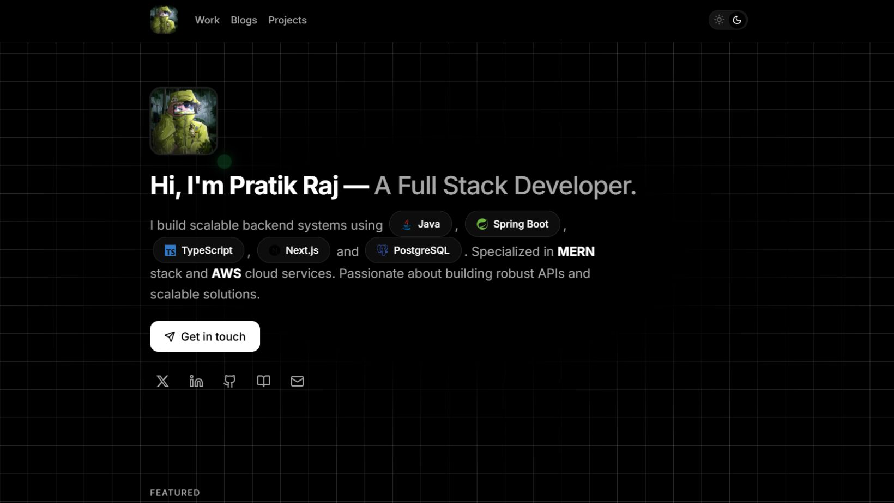
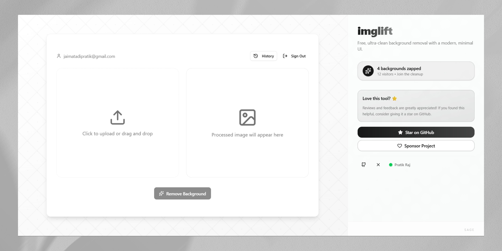

<!-- Typing header -->

  

## About

I am **Pratik Raj**, a **Backend and Full-Stack Developer** with experience across **Java, Spring Boot, MERN, Next.js, Supabase, PostgreSQL, and AWS**.

My work focuses on designing **scalable backend architectures**, building **high-performance APIs**, and delivering **production-ready full-stack applications** with clean, maintainable code. I have a strong understanding of modern web development, system design fundamentals, and end-to-end application deployment.

## Projects and Portfolio

<table>
  <tr>
    <td width="50%">
      
    </td>
    <td width="50%">
      
    </td>
  </tr>
  <tr>
    <td width="50%">
      
    </td>
    <td width="50%">
      
    </td>
  </tr>
</table>

## Technology Stack

  

## Links

  
  

